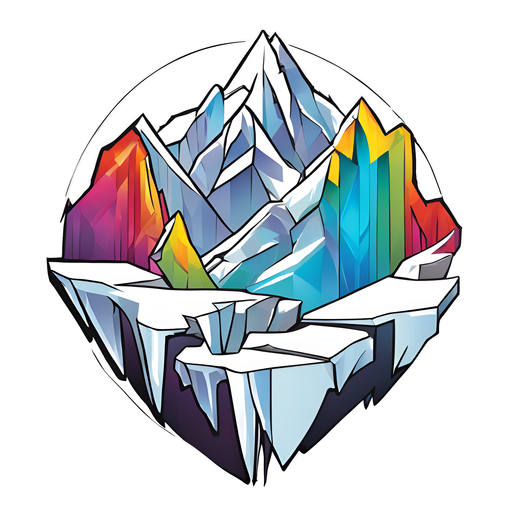

# Gleaming Glacier — Copper's Dotfiles

  

These are my dotfiles, i.e., the configurations for my systems and tools, structured as a Nix flake, which makes them easy to install and reproduce.
> There are many like it, but these ones are mine.

  
  
  
  

-------------------

  <a href="https://gleaming-glacier.vercel.app">Documentation</a> | <a href="https://gleaming-glacier.vercel.app/usage">Getting Started</a> | <a href="#showcase">Showcase</a> | <a href="https://gleaming-glacier.vercel.app/highlights">Notable Features</a> | <a href="https://gleaming-glacier.vercel.app/faq">FAQ</a> | <a href="./CONTRIBUTING.md">Contributing</a>

-------------------

## Showcase

NixOS Desktops with
* **[Hyprland](https://hyprland.dev)** with a bunch of plugins
* Almost a full DE based on **[AGS](https://github.com/Aylur/AGS)**
* My own system for **modal keymaps**
* A powerful **theming** system
* Full Disk Encryption on **ZFS**
* Easy Deployment

NixOS Servers with
* **Remote unlocking** during boot
* **Impermanence**
* Full Disk Encryption on **ZFS**
* Easy Deployment

macOS with
* **[Yabai](https://github.com/koekeishiya/yabai)** tiling window manager
* **[SketchyBar](https://github.com/FelixKratz/SketchyBar)**
* **[skhd](https://github.com/koekeishiya/skhd)** for model keymaps
* My own **theming** system

My powerful **Fish**-based shell environment.

## Highlights

### Copper Chroma

Chroma is my powerful theming system for [Home-Manager](https://github.com/nix-community/home-manager).
It supports coordinating theme switches across many applications, without rebuilding or switching your Home configuration and is highly extensible.

### Copper Mage

Mage is my abstraction on top of [Agenix](https://github.com/ryantm/agenix) to make secret management easier and require less configuration.

### Copper Plate

Plate is my own simple provisioning framework.
It supports installing configurations on remote systems using [nixos-anywhere](https://github.com/nix-community/nixos-anywhere) or building your very own installation image that comes with the system configuration of yourself.
To this end, it comes with a custom text-based installer.

### Gleaming Framework

My framework for structuring my (and possibly your!) Flake based on the structure of Nix files in the file tree.
It removes the need to manually import every file and loads them automatically instead.
Additionally, it adds useful functionality in the form of [flake-parts](https://flake.parts) modules.

## Who is this for?

This repository can be seperated into two primary components:
* My own personal configurations set up to my liking
* A framework for building your own Flake that mine is built on as well

However, my own configuration is also built to be highly modular, so you can easily re-use any parts that you like.
While the Flake framework is designed to be generic, my own configurations are not.
That means that if you have similar requirements as I, you may find them useful, but if yours are wildly different you may not.
Supporting every possible use case is not a goal for my own configuration.
Or, you might just want to peruse the flake to get some inpiration for your own.

To get started on using my configuration, please see the [Getting Started](https://gleaming-glacier.vercel.app/getting-started) page.

## Versioning

At this time, some of the features in my Flake are still under development, even though speed of development has slowed.
I am intentionally not versioning it and make no promises about the stability of any particular API.
That said, I'll try to make changes to the `master` in a backwards-compitable fashion where possible and not to break things too much.
Active development happens on branches where changes might be more common.

Additionally, breaking changes should be documented in the [Changelog](CHANGELOG.md).

Still, if you rely on my Flake, be sure to use a particular version and be prepared to occasionally make some changes when upgrading to a new commit.

## License

See [LICENSE.md](./LICENSE.md).

## Contributing

See [CONTRIBUTING.md](./CONTRIBUTING.md).

## Credits and Resources

These dotfiles reuse parts of various others' configurations and are inspired by many more.

In particular, configuration from the following repositories was used:

* [FelixKratz' dotfiles](https://github.com/FelixKratz/dotfiles/) from which I initially copied the skhd, yabai and SketchyBar config, available under the terms of GPLv3
* [ghostx31's dotfiles](https://github.com/ghostx31/dotfiles) whose Wezterm config I am using
* [hunterliao29's Apple Music plugin for sketchybar](https://github.com/FelixKratz/SketchyBar/discussions/12#discussioncomment-4406700)
* [khaneliman's dotfiles](https://github.com/khaneliman/dotfiles) from where I took some sketchybar configuration
* [yuanw's nix-home](https://github.com/yuanw/nix-home) which is the origin of my icalBuddy derivation
* [EphraimSiegfried's Calendar plugin for Sketchybar](https://github.com/FelixKratz/SketchyBar/discussions/12#discussioncomment-4730516)
* [Prasanthrangan's Hyprdots](https://github.com/prasanthrangan/hyprdots/) which is the origin for many of my Hyprland-related configurations licensed under the terms of GPLv3

Additionally, I learned a lot from these repositories, listed in no particular order:

* [Misterio77's Flake](https://github.com/Misterio77/nix-config)
* [MatthiasBenaets's Flake](https://github.com/MatthiasBenaets/nixos-config/tree/master)
* [Pimey's Flake](https://github.com/pimeys/nixos)
* [alodborrero's templates](https://github.com/aldoborrero/templates/tree/main/templates/blog/nix/setting-up-machines-nix-style)
* [alexghr's Flake](https://github.com/alexghr/nix)

Special thanks also go to the creators of the various tools and programs that I use in my configuration.

If you believe you were missed in the list above, please let me know.
